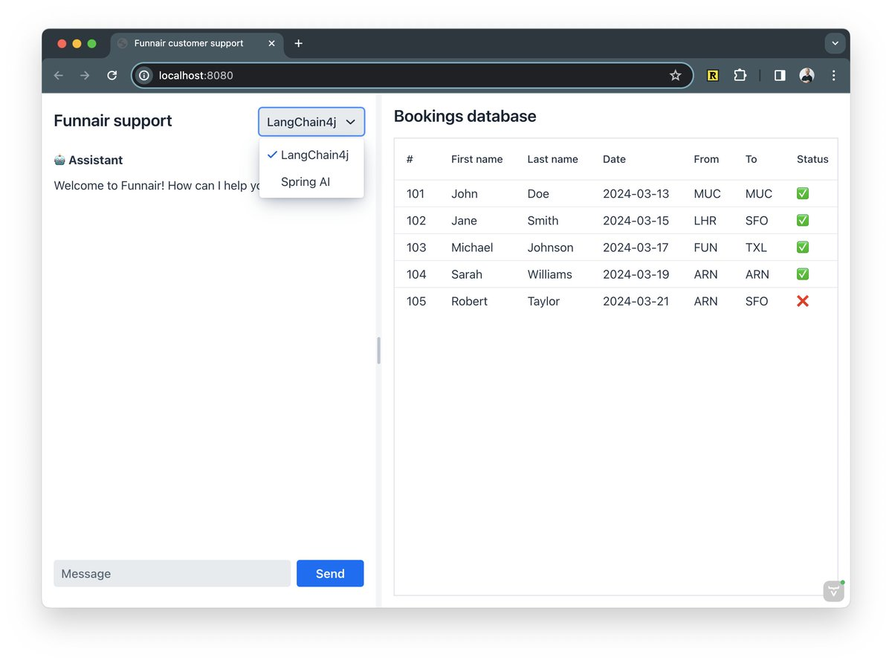

# Java AI library comparison app

This app is an AI-powered customer support application that:

- Has access to terms and conditions (retrieval augmented generation, RAG)
- Can access tools (Java methods) to perform actions
- Uses an LLM to interact with the user

The application includes implementations for: 

- [LangChain4j](https://github.com/langchain4j/langchain4j) in the `main` branch
- [Spring AI](https://spring.io/projects/spring-ai/) in the `spring-ai` branch (thanks to [@tzolov](https://github.com/tzolov)!)

The UI is built using [Vaadin Hilla](https://vaadin.com) and the backend is built using Spring Boot.

## Requirements
- Java 17+
- OpenAI API key in `OPENAI_API_KEY` environment variable

## Running
Run the app by running `Application.java` in your IDE or `mvn` in the command line.

## Thanks
This demo was inspired by the [LangChain4jCustomer Support Agent example](https://github.com/langchain4j/langchain4j-examples/tree/main/spring-boot-example/src/main/java/dev/langchain4j/example).

I want to thank the LangChain4j and Spring AI teams for their support in building this demo.
Especially, I want to thank [@tzolov](https://github.com/tzolov) from The Spring AI team for his help in building the Spring AI implementation.
